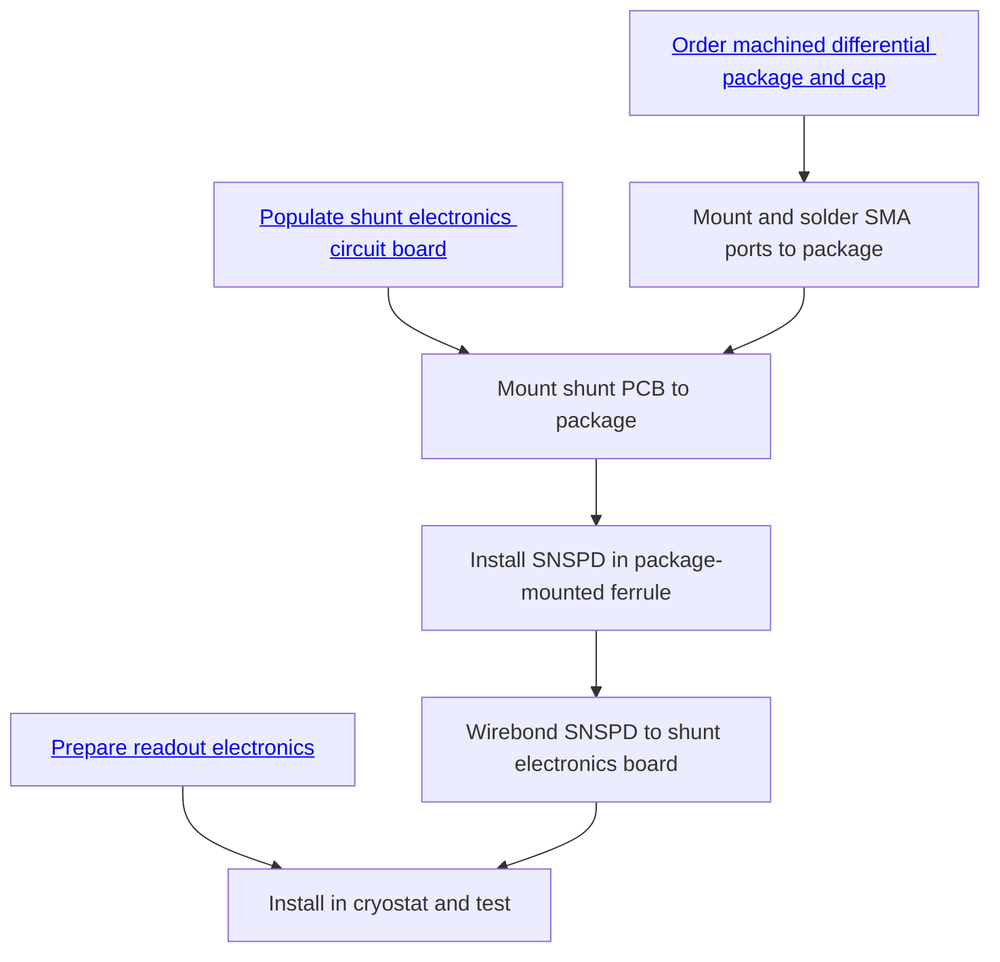

# Index

<h2>Diff-SNSPDs: Packaging, Ordering, and Installation Guide</h2>

### Tasks

```mermaid
graph TD
    G[<a href='/packaging/#shunt-PCB'>Populate shunt electronics circuit board</a>] --> B
    E[<a href='/readout/#readout'>Prepare readout electronics</a>] --> F[Install in cryostat and test]
    AA[<a href='/mechanics/#detector-packages-with-sapphire-rods'>Order machined differential package and cap</a>] -->A[Mount and solder SMA ports to package]
    A --> B[Mount shunt PCB to package]
    B --> C[Install SNSPD in package-mounted ferrule]
    C --> D[Wirebond SNSPD to shunt electronics board]
    D --> F
```

### Orders

