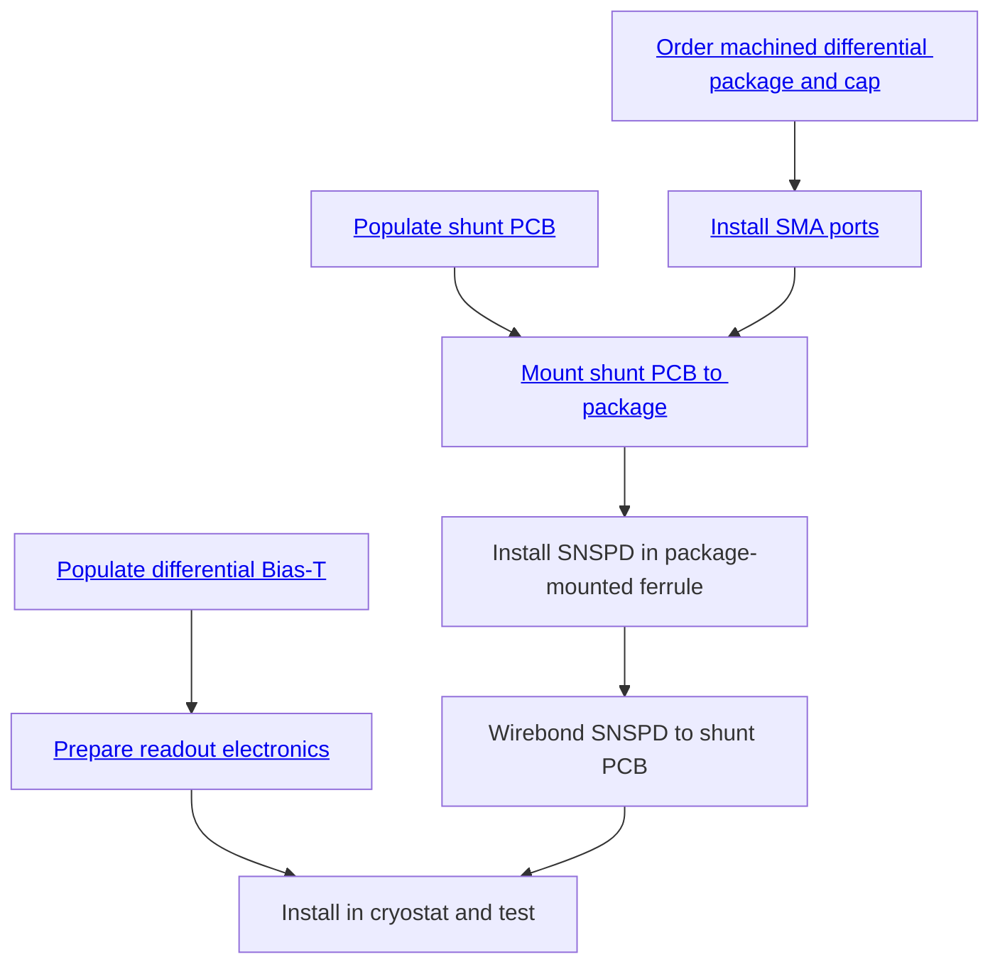

# Index

<h2>Diff-SNSPDs: Packaging, Ordering, and Installation Guide</h2>

### Tasks

Certain steps of building the differential SNSPDs must happen in order.

<!-- [link to other thing](./packaging/#Other-thing) -->

!!! TODO
Eventually all these steps should have link to explanatory sections.

### Orders

!!! TODO
Pasternack and Digikey orders here
