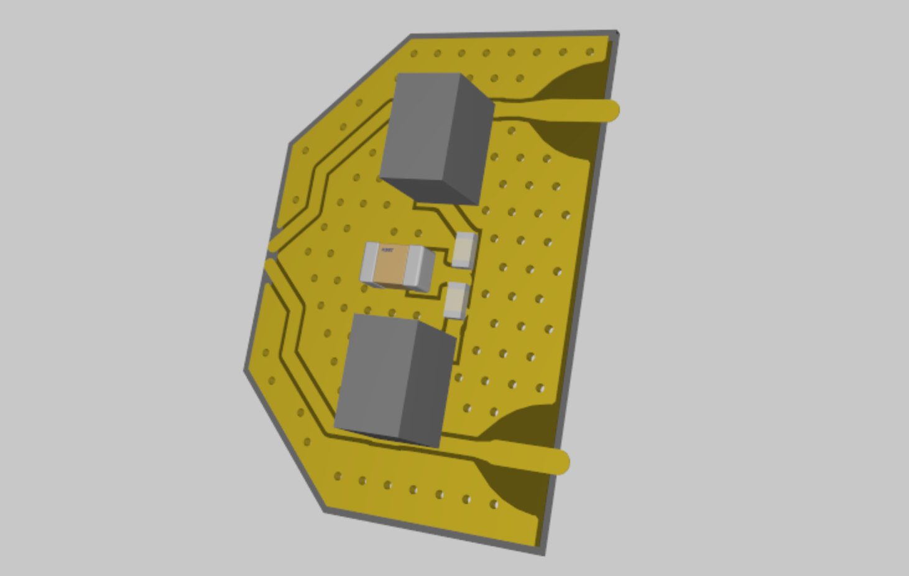
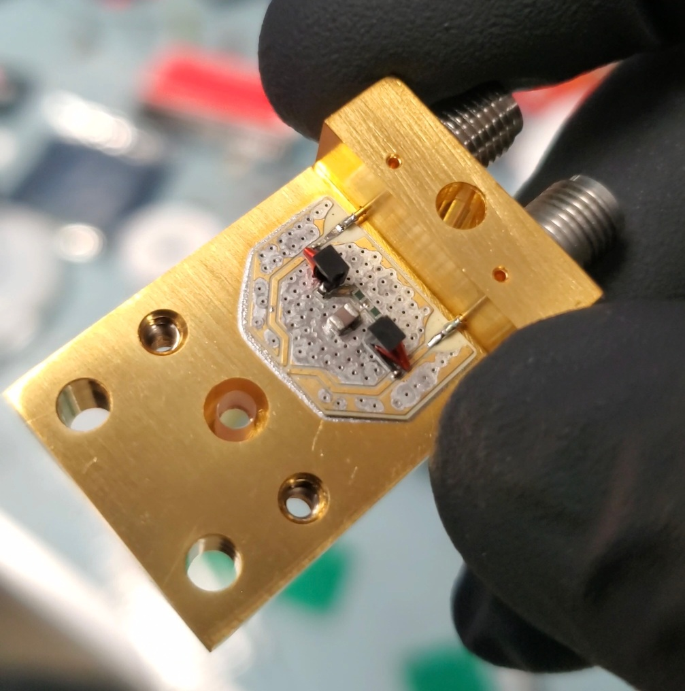

## Shunt PCB

<!-- 

 -->

    

        
    

    

        
    

The shunt resistor PCB is soldered onto the main gold-plated differential SMA package. Altium files related to it are available [here](./attachments/diff_shunt_interface.zip){:download="diff_shunt_interface.zip"}

