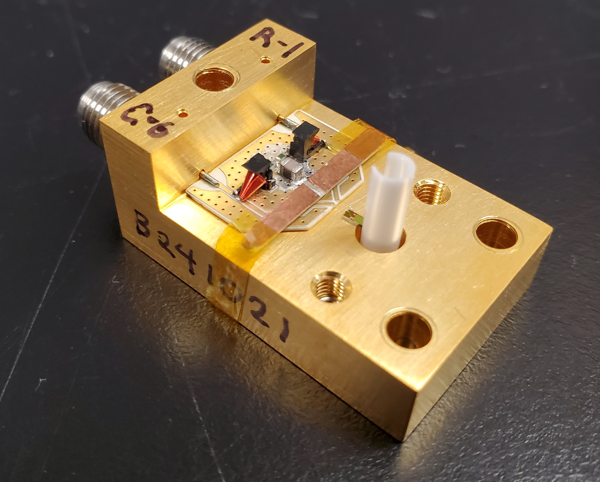
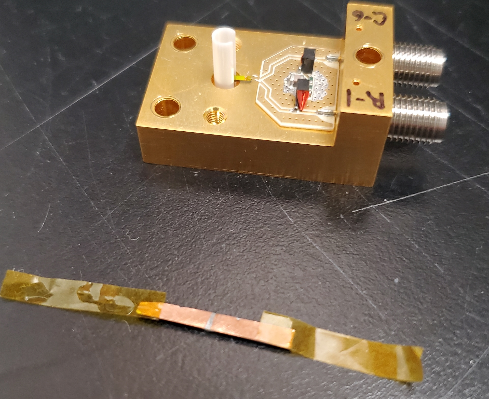

## Shunt PCB

<!-- 

 -->

    

        
    

    

        
    

The shunt resistor PCB is soldered onto the main gold-plated differential SMA package. Altium files related to it are available [here](./attachments/diff_shunt_interface.zip){:download="diff_shunt_interface.zip"}

As manufactured, the shunt PCB is populated with:

| number | type      | value    | size           | serial number     |
| ------ | --------- | -------- | -------------- | ----------------- |
| 1x     | capacitor | ~0.43 nF | 0805           |                   |
| 2x     | resistor  | 50Ω      | 0402 (1x0.5mm) |                   |
| 2x     | inductor  | 0.47 µH  |                | 506WLSM0R47KT815T |

### Manufacture

#### Manufacture:

- Apply solder paste with solder mask
- Populate PCB with pick and place machine
- Heat up in oven or on hot plate

## Install Shunt PCB

- Apply solder paste to the gold plated detector package, with SMA center pins installed. You will hav to place down the PCB, then slide it underneath the SMA pins protruding through the small machined holes in the package. Three small dots of paste should be enough.
- Do NOT add solder paste between the SMA pins and the corresponding pads on the shunt PCB package at this stage. If you do this, there is a high chance that solder will flow into the hole through which the SMA pin travels, thereby shorting the center pin to ground.
- Head up whole package and PCB in the oven.
- After the package has cooled, you can solder the SMA center pins to the shunt PCB package with a soldering iron.

Note: you shouldn't need to have the [SMA connector](https://www.hasco-inc.com/connectors/220-502sf-super-sma-jack-female-thread-in-accepts-pin-dia-020/) installed into the package when you put the whole thing in the oven to solder on the shunt PCB. The center pin -- already soldered in place -- shouldn't move much when it's re-flowed

## Packaging

One method for installing the detector in the ferrule sleeve is shown in the video. It involves holding the ferrule sleeve with a vise and tweezers, and dropping the SNSPD onto it upside down.

<iframe width="560" height="315" src="https://www.youtube.com/embed/T0ASwPOWdbc?si=BeAsV9GJEB3OgUI0" title="YouTube video player" frameborder="0" allow="accelerometer; autoplay; clipboard-write; encrypted-media; gyroscope; picture-in-picture; web-share" referrerpolicy="strict-origin-when-cross-origin" allowfullscreen></iframe>

There's another method too, whereby you keep the SNSPD on a flat surface, and press the ferrule sleeve down onto it from above. Its possible that this method works fine, but only when the fit between the SNSPD and the ferrule isn't too tight.

## Wire bonding

It can be nice to measure the resistance of the SNSPDs. If they haven't been proved in a cryogenic probe station, measuring the resistance can give you higher confidence that the detector will function. Because of the shunt PCB and it's integrated 100 Ω resistance between the differential channels, measuring the detector resistance after packaging is not possible. You would simply measure 100 Ω, instead of the ~10 MΩ of the SNSPD itself.

To gain the some peace of mind that you are packaging a functioning SNSPD, you can measure the resistance as part of the wire bonding process. DO this by cutting a sliver of copper coated FR4, and scraping the copper off in a region in the middle. Thereby making a strip of material with two pads you can wire bond the SNSPD to temporarily. Then, measure the resistance across these pads. If you do this at the wire bonder, the added time from bonding to the strip of FR4, measuring resistance, breaking the bonds, and then re-bonding to the shunt PCB isn't too significant.

The strip of FR4 taped to the package for temporary wire bonding:

The strip of FR4 by itself

