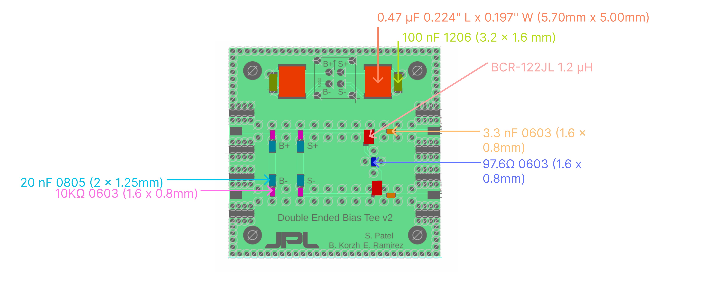

# Readout

## Differential Bias Tee

For the 12 new differential SNSPDs we've stuck with tried and true (old design) Bias Tee. Though originally designed for use inside the cryostat, they work fine at room temperature as well. 

The circuit board drawings can be downloaded [here](./attachments/Diff_bias_T.zip)

### Layout

### Apply solder mask

Download the solder mask from [here](./attachments/solder_mask.gtp)